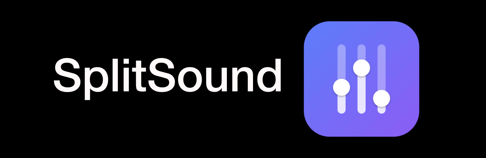
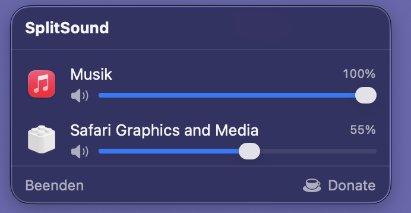
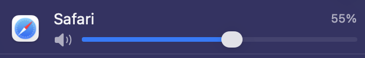

<div align="center">



**A per-app volume mixer for the macOS menu bar.**

Turn the video down, the music up, the meeting off — each app on its own slider.
The thing Windows has had for years and macOS still does not ship.



</div>

---

## What it does

- **Per-app volume** — every app producing sound gets its own slider
- **Mute individually**, without touching the app itself
- **Settings stick** — Safari stays quiet, even after a restart
- **Shows only what is playing** — not an endless list, just the apps making sound
- **Stays out of the way** — lives in the menu bar, no window, no Dock icon

## Install

1. Download the latest build from [Releases](https://github.com/makogre/splitsound/releases)
2. Open the DMG and drag **SplitSound** into **Applications**
3. On first launch: **right-click the app → "Open"**, then "Open" again in the dialog

> The right-click is necessary because the app is not yet notarized with Apple,
> so macOS blocks it otherwise. After that it launches normally.

The first time you adjust a volume, macOS asks once for permission to record
audio. SplitSound needs it to intercept an app's sound and play it back quieter —
there is no other way to change another app's volume on macOS.

**Requires macOS 14.4 or newer.**

## Using it

Click the slider icon in the menu bar. Each row is one app:



| Element | Effect |
|---|---|
| Slider | Volume for this app, 0 – 100 % |
| Speaker icon | Mute and unmute |
| Dimmed row | App is currently silent, sticks around briefly |

An app at 100 % and unmuted is left alone — SplitSound only inserts itself where
there is actually something to adjust.

The gear icon opens settings: launch at login, whether system processes are
listed, how long silent apps stick around, and a reset for saved volumes.

## Good to know

**The first slider drag may click briefly.** That is the moment SplitSound
inserts itself into the app's audio path.

**Command line players show up too.** Anything producing audio appears, including
tools like `afplay` that have no icon.

## Building from source

```sh
brew install xcodegen
xcodegen generate
open SplitSound.xcodeproj      # set your signing team, then Run
```

Build a DMG:

```sh
./scripts/build-release.sh     # -> dist/SplitSound-<version>.dmg
```

Run the tests:

```sh
./scripts/test.sh
```

How it works internally, which Core Audio pitfalls are waiting for you, and
what is still open: see **[docs/TECHNICAL.md](docs/TECHNICAL.md)**.

## Support

SplitSound is free and open source. If it saves you some hassle, a coffee is
always welcome: [buymeacoffee.com/makogre](https://buymeacoffee.com/makogre)

## License

[MIT](LICENSE)
