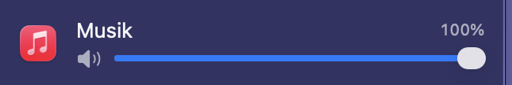

<div align="center">

# SplitSound

**Ein Lautstärkemixer für die macOS-Menüleiste.**

Regle den Ton jeder App einzeln — Video leiser, Musik lauter, Meeting stumm.
Das, was der Lautstärkemixer unter Windows kann und macOS bis heute nicht mitbringt.

<!-- Screenshot des geöffneten Mixers in der Menüleiste -->


</div>

---

## Was es kann

- **Lautstärke pro App** — jede tonausgebende App bekommt einen eigenen Regler
- **Einzeln stummschalten**, ohne die App zu berühren
- **Einstellungen bleiben gespeichert** — Safari bleibt leise, auch nach dem Neustart
- **Zeigt nur, was gerade läuft** — keine endlose Liste, sondern die Apps, die
  tatsächlich Ton machen
- **Bleibt aus dem Weg** — lebt in der Menüleiste, kein Fenster, kein Dock-Symbol

## Installation

1. Neueste Version unter [Releases](https://github.com/makogre/splitsound/releases) herunterladen
2. DMG öffnen, **SplitSound** in den Ordner **Programme** ziehen
3. Beim ersten Start: **Rechtsklick auf die App → „Öffnen"**, im Dialog nochmals „Öffnen"

> Der Rechtsklick ist nötig, weil die App noch nicht bei Apple notariell
> registriert ist. macOS blockiert sie sonst. Danach startet sie normal.

Beim ersten Regeln fragt macOS einmalig nach der Erlaubnis, Audio mitzuschneiden.
Die braucht SplitSound, um den Ton einer App abzufangen und leiser wieder
auszugeben — anders lässt sich die Lautstärke fremder Apps unter macOS nicht
verändern.

**Voraussetzung:** macOS 14.4 oder neuer.

## Bedienung

<!-- Screenshot einer einzelnen Kanalzeile, ggf. mit Beschriftungen -->


Klick auf das Schieberegler-Symbol in der Menüleiste. Jede Zeile ist eine App:

| Element | Wirkung |
|---|---|
| Regler | Lautstärke dieser App, 0 – 100 % |
| Lautsprecher-Symbol | Stummschalten und wieder aufheben |
| Ausgegraute Zeile | App ist gerade still, bleibt kurz stehen |

Eine App auf 100 % ohne Stummschaltung wird nicht angefasst — SplitSound
klinkt sich nur dort ein, wo wirklich etwas zu regeln ist.

## Gut zu wissen

**Safari heißt „Safari Graphics and Media".** Der Ton kommt bei Safari nicht aus
dem Browser selbst, sondern aus einem Hilfsprozess. Alle WebKit-Browser teilen
sich diesen Namen.

**Beim ersten Ziehen des Reglers kann es kurz knacken.** In dem Moment klinkt
sich SplitSound in den Tonweg der App ein.

## Aus dem Quelltext bauen

```sh
brew install xcodegen
xcodegen generate
open SplitSound.xcodeproj      # dort Signing-Team setzen, dann Run
```

Fertiges DMG bauen:

```sh
./scripts/build-release.sh     # -> dist/SplitSound-<version>.dmg
```

Tests:

```sh
xcodebuild test -project SplitSound.xcodeproj -scheme SplitSound -destination 'platform=macOS'
```

Wie das Ganze intern funktioniert, welche Fallstricke Core Audio hier bereithält
und was noch offen ist, steht in **[docs/TECHNIK.md](docs/TECHNIK.md)**.

## Lizenz

[MIT](LICENSE)
